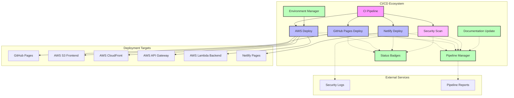

# GitHub Workflows

This directory contains GitHub Actions workflows for CI/CD automation.

## Workflow Summary

| Workflow | Description | Triggers | Last Run |
|----------|-------------|----------|----------|
| [CI Pipeline](.github/workflows/ci.yml) | Run automated tests, code quality checks, and build the application | push, pull_request, workflow_dispatch | N/A |
| [GitHub Pages Deployment](.github/workflows/github-pages-deploy.yml) | Deploy the application to GitHub Pages | workflow_run, push, workflow_dispatch | N/A |
| [AWS Deployment](.github/workflows/aws-deploy.yml) | Deploy the application to AWS infrastructure | workflow_run, push, workflow_dispatch | N/A |
| [Security Scanning](.github/workflows/security-scan.yml) | Perform security analysis of code, dependencies, and infrastructure | schedule, workflow_dispatch | N/A |
| [Pipeline Manager](.github/workflows/pipeline-manager.yml) | Provide pipeline visualization and management capabilities | workflow_run, workflow_dispatch | N/A |
| [Status Badges](.github/workflows/status-badges.yml) | Update status badges for GitHub repository | workflow_run, workflow_dispatch | N/A |
| [Environment Manager](.github/workflows/environment-manager.yml) | Manage deployment environments | workflow_dispatch | N/A |
| [Documentation Update](.github/workflows/documentation-update.yml) | Update workflow documentation | schedule, push, workflow_dispatch | N/A |

## Manual Workflow Execution

Workflows can be executed manually from the Actions tab in GitHub or using the GitHub CLI:

```bash
# Install GitHub CLI if needed
# https://cli.github.com/manual/installation

# Run a workflow
gh workflow run WORKFLOW_NAME.yml

# Run with inputs (if supported by the workflow)
gh workflow run WORKFLOW_NAME.yml -f param1=value1 -f param2=value2
```

## Adding New Workflows

When adding new workflows, please follow these guidelines:

1. Use clear, descriptive names for workflow files
2. Include a short description comment at the top of the file
3. Document inputs and outputs in the workflow file
4. Update the main workflow documentation in `.github/CICD-WORKFLOWS.md`

## Workflow Topology

The CI/CD ecosystem topology can be visualized with Mermaid. The source diagram is in `.github/workflow-info/topology.mmd`.

